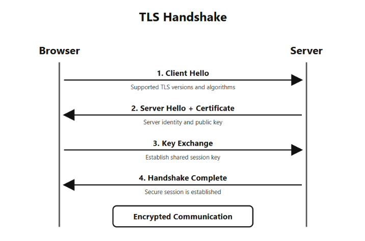

# Understand Secure Communications

## Content

1. [HTTPS](#1-https)
2. [TLS](#2-tls)
3. [SSL History](#3-ssl-history)
4. [Secure Channels](#4-secure-channels)
5. [Certificate Concepts](#5-certificate-concepts)

---

## 1. HTTPS

**HTTPS (HyperText Transfer Protocol Secure)** = secure version of HTTP that protects communication between client and server using TLS.

### HTTP vs HTTPS

* **HTTP** = no encryption.
* **HTTPS** = uses TLS to protect communication.

### HTTPS Security

* **Encryption** → protects data from being read.
* **Integrity** → helps detect data modification.
* **Authentication** → helps verify the server's identity.

### Important

**HTTPS = HTTP + TLS**

HTTPS does not guarantee that the website itself is trustworthy.

---

## 2. TLS

**TLS (Transport Layer Security)** = security protocol that protects data while it travels between systems.

### Main Benefits

* **Encryption** → protects data.
* **Integrity** → detects modification.
* **Authentication** → verifies server identity.

### TLS Versions

* TLS 1.0 → outdated
* TLS 1.1 → outdated
* TLS 1.2 → widely supported
* TLS 1.3 → modern

### TLS Cryptography

* **Asymmetric cryptography** → authentication and key establishment.
* **Symmetric cryptography** → encrypts actual communication.

### TLS Handshake

```text
Browser                  Server
   |                       |
   |  Client Hello         |
   |---------------------->|
   |                       |
   |  Server Hello         |
   |  + Certificate        |
   |<----------------------|
   |                       |
   |  Key Exchange         |
   |<--------------------->|
   |                       |
   | Encrypted Data        |
   |<=====================>|
```


**TLS Handshake = process used to establish a secure connection.**

### Session Key

**Session key** = temporary symmetric key used to encrypt data during a TLS session.

### Perfect Forward Secrecy

**PFS** = helps protect previous sessions even if a long-term private key is compromised later.

---

## 3. SSL History

**SSL (Secure Sockets Layer)** = older protocol designed to secure network communication.

### SSL vs TLS

* **SSL** → old and outdated.
* **TLS** → modern replacement for SSL.

### SSL Versions

* SSL 2.0 → insecure
* SSL 3.0 → insecure and deprecated

### Important

Modern HTTPS uses **TLS**, not SSL.

The term **"SSL certificate"** is still commonly used, but modern HTTPS connections use TLS.

---

## 4. Secure Channels

**Secure channel** = protected communication path that helps keep data secure while traveling between systems.

### Encryption in Transit

**Encryption in transit** = encrypting data while it travels over a network.

### HTTPS

```text
Browser ─── TLS/HTTPS ───> Web Server
```

Used for secure web communication.

### SSH

**SSH (Secure Shell)** = protocol mainly used for secure remote access to computers and servers.

```text
Computer ─── SSH ───> Remote Server
```

### TLS-Secured APIs

```text
Application ─── HTTPS/TLS ───> API Server
```

Protects data exchanged between applications and APIs.

### VPN Tunnel

**VPN tunnel** = encrypted connection over an untrusted network.

```text
Device
  ↓
Encrypted VPN Tunnel
  ↓
VPN Server
  ↓
Internet
```

---

## 5. Certificate Concepts

**Digital Certificate** = digital document that helps verify a website's identity and contains its public key.

### Certificate Authority

**CA (Certificate Authority)** = trusted organization that verifies identities and issues digitally signed certificates.

### Important Certificate Fields

* Domain / Identity
* Public Key
* Issuer
* Validity Period
* Digital Signature

### Certificate Chain

```text
Root CA
   ↓
Intermediate CA
   ↓
Website Certificate
   ↓
Browser
```

* **Root CA** → trusted authority.
* **Intermediate CA** → authorized certificate issuer.
* **Website Certificate** → identifies the website and contains its public key.

### Certificate Validation

Browser checks:

* Correct domain
* Valid certificate
* Valid dates
* Valid digital signature
* Trusted certificate chain

### Certificate Expiry

**Expired certificate** → browser may show a security warning.

### Certificate Revocation

**Revocation** = making a certificate no longer trusted before its expiry.

**CRL (Certificate Revocation List)** = list of revoked certificates.

**OCSP (Online Certificate Status Protocol)** = checks the revocation status of a certificate online.

---

## Practical

Later in **Task 10**, practice:

* Analyze HTTPS traffic
* Inspect website certificates
* Check TLS versions
* Understand TLS handshake
* Use OpenSSL
* Use CyberChef where useful

---

## Quick Revision

* **HTTPS** = HTTP protected by TLS.
* **TLS** = protects data in transit.
* **SSL** = old, replaced by TLS.
* **Secure Channel** = protected communication path.
* **Certificate** = verifies website identity + contains public key.
* **CA** = trusted certificate issuer.
* **Certificate Chain** = Root CA → Intermediate CA → Website Certificate.
* **CRL** = list of revoked certificates.
* **OCSP** = checks certificate revocation status.
