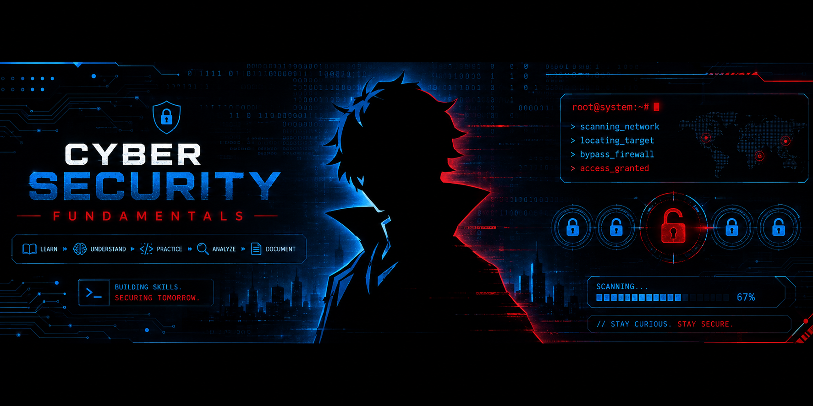

<div align="center">

# 🛡️ Cyber Security Fundamentals



### 🔐 Learn → Understand → Practice → Analyze → Document

[](https://www.linkedin.com/in/arjun37/)

</div>

---

## 📖 About This Repository

This repository documents my **Cyber Security learning journey** as a Brototype student, covering foundational concepts, technical knowledge, security research, and hands-on security practice.

Each module combines theoretical understanding with practical application.

### 📚 What You'll Find Here

* 📚 **Theory** — Core concepts and security fundamentals
* 🔎 **Research** — Security research and analysis
* 🧪 **Hands-on Tasks** — Practical exercises and labs
* 📝 **Documentation** — Notes, reports, and findings
* 💻 **Projects** — Practical work demonstrating learned concepts

---

## 🔄 Learning Process

```text
Learn → Understand → Practice → Analyze → Document
```

---

## 🎯 Learning Objective

To develop a strong foundation in cybersecurity and progressively build **practical, analytical, and problem-solving skills** through continuous learning and hands-on experience.

---

## 👨‍💻 Connect With Me

**Arjun R**

🎓 Diploma CSE Student
🔐 Cyber Security | Ethical Hacking | SOC
🚀 Open to Internships & Jobs

🔗 **LinkedIn:** [linkedin.com/in/arjun37](https://www.linkedin.com/in/arjun37/)

---

<div align="center">

### 🛡️ Cyber Security Learning Journey

*Learning today. Securing tomorrow.*

</div>
